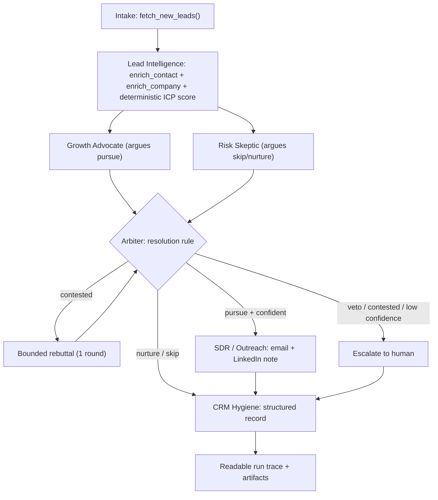

# FirstTouch - Inbound Lead Triage Agent Team

_by Mark Takla_

A believable team of AI agents that takes a raw inbound lead, enriches it, **debates** whether to pursue it, resolves the debate with an explicit rule, and (if pursued) drafts outreach and writes a clean CRM record - with a full, readable trace of who said what and why. No human in the loop on the happy path; a human is pulled in only when it genuinely matters.

Scope is the **Sales slice only** (intake -> first touch), per the brief.

## Demo

Watch a short walkthrough of the live UI working a lead end-to-end: **[Demo video](https://drive.google.com/file/d/1cgTYQHFOtthD9z2wcmshZ3OlokXNpYWg/view?usp=sharing)**

- **Stack:** Python + LangChain, free **Llama 3.x on Groq** (`langchain-groq`), Pydantic typed contracts, Streamlit UI.
- **Backend:** [`sircles_core.py`](sircles_core.py) is the single source of truth (schemas, mock tools, ICP scoring, agents, Arbiter, orchestrator).
- **UI:** [`app.py`](app.py) - a real-time Streamlit app that shows the workflow and the debate as they happen.
- **Notebook:** [`sircles_lead_agents.ipynb`](sircles_lead_agents.ipynb) - a narrated walkthrough (imports the backend) that produces the two run traces and runs the tests.
- **Design principle - debate first:** before any consequential action, two agents with opposed objectives put forward competing recommendations, and a deterministic Arbiter resolves the disagreement and records the dissent.

## Deliverables (per the brief)

| Deliverable | Where |
|---|---|
| Runnable source + one-command setup | this README + `requirements.txt` |
| Architecture diagram | below (Mermaid) |
| Run trace for a clear case + an ambiguous (debate) case | notebook Section 8, or live in the UI |
| ~1-page design note (the four business questions) | [`DESIGN_NOTE.pdf`](DESIGN_NOTE.pdf) |
| A few tests (resolution rule + an agent contract) | notebook Section 9 |

## Architecture



## The debate mechanism (all five required elements)

| Element | How it is implemented |
|---|---|
| Competing positions | **Growth Advocate** vs **Risk Skeptic** - different system prompts, opposed objectives, different evidence lenses. |
| Stated confidence | Each `Position` carries a `confidence` (0-1) plus `key_evidence` and `risks`. |
| Resolution rule | Deterministic Arbiter: critic veto -> confidence-weighted vote -> bounded rebuttal -> escalation. |
| Recorded dissent | The losing `Position` and *why it lost* are stored in the `Resolution` and shown in the trace/UI. |
| Escalation path | Competitor veto, unresolved debate, or low data completeness set `escalate=True` -> `human_review`. |

## Setup

Prerequisites: **Python 3.11+** and a free **Groq API key** (https://console.groq.com/keys).

### 1. Create a virtual environment and install dependencies

Windows (PowerShell):

```powershell
python -m venv .venv
.\.venv\Scripts\Activate.ps1
pip install -r requirements.txt
```

macOS / Linux:

```bash
python3 -m venv .venv
source .venv/bin/activate
pip install -r requirements.txt
```

> If `python` is not found on Windows, use your full interpreter path or `py -m venv .venv`.
> If PowerShell blocks activation, run `Set-ExecutionPolicy -Scope Process -ExecutionPolicy Bypass` for this session, or just call the venv binaries directly (e.g. `.\.venv\Scripts\streamlit.exe run app.py`).

### 2. Add your API key

```powershell
copy .env.example .env      # macOS/Linux: cp .env.example .env
```

Then edit `.env` and set:

```
GROQ_API_KEY=your_groq_api_key_here
# optional: GROQ_MODEL=llama-3.3-70b-versatile   (or llama-3.1-8b-instant)
```

## Run & test with the UI (recommended)

```powershell
streamlit run app.py
# or without activating the venv:
.\.venv\Scripts\streamlit.exe run app.py
```

This opens FirstTouch at http://localhost:xxxx. To test it:

1. In the sidebar, pick a **model** and a **lead** (the four sample leads, or fill in a custom one).
2. Press **Run workflow** and watch it live: enrichment + ICP breakdown bars, the **Advocate vs Skeptic** debate streaming in, the rebuttal round (when contested), the **Arbiter verdict** with the exact rule and recorded dissent, a magenta **escalation banner** when a human is needed, and the outreach + CRM artifacts.
3. Suggested demo path: run **`L-001`** (clean autonomous pursue) then **`L-003`** (competitor -> debate -> escalation).

> A Streamlit app must be started with `streamlit run app.py` - running `python app.py` will not work.

## Run the notebook (reference) + tests

```powershell
jupyter notebook sircles_lead_agents.ipynb       # pick the "FirstTouch (.venv)" kernel
```

Run cells top to bottom: **Section 8** produces the two required traces (clear + ambiguous), **Section 9** runs the tests.

Headless execution:

```powershell
jupyter nbconvert --to notebook --execute sircles_lead_agents.ipynb --output executed.ipynb
```

The tests (resolution rule + the Lead Intelligence/ICP contract) are deterministic and **run without an API key**.

## Sample leads & expected outcomes

| Lead | Who | Expected | Why |
|---|---|---|---|
| `L-001` | VP Marketing, Cairo Series B B2B SaaS | **pursue -> auto_send** | Strong fit, decision-maker, growth signals, in-region. |
| `L-002` | Solo freelancer on Gmail | **skip -> archive** | `no_budget_micro` disqualifier; no buyer, no budget. |
| `L-003` | Head of Growth at a marketing **agency** | **escalate -> human_review** | Great fit on paper, but a competitor: conflict or partnership is a human call. |
| `L-004` | Pre-seed Egyptian founder | **nurture** | Good fit but explicit "no budget yet" caps at nurture. |

## Project structure

```
.
|- sircles_core.py             # backend: schemas, mock tools, ICP, agents, Arbiter, orchestrator
|- app.py                      # Streamlit live debate UI (imports sircles_core)
|- sircles_lead_agents.ipynb   # narrated notebook: runs + tests (imports sircles_core)
|- DESIGN_NOTE.md              # 1-page design note (the four business questions)
|- .streamlit/config.toml      # brand theme (dark + magenta)
|- requirements.txt
|- .env.example                # copy to .env, add GROQ_API_KEY
|- .gitignore
|- README.md
```

## Design decisions

The reasoning behind the cost-of-wrong asymmetry, the ICP scoring (including the Egypt location weighting), the confidence-to-action thresholds, the debate/resolution design, what I'd build with two more weeks, and where it breaks at scale is in [`DESIGN_NOTE.md`](DESIGN_NOTE.md).

## Notes

- Mock tools are stubbed from in-code fixtures - no live external APIs.
- LLM temperature is low (0.2) so the deterministic logic dominates; dispositions/actions are stable while debate wording varies slightly run-to-run.
